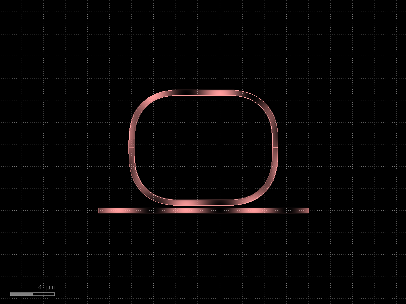
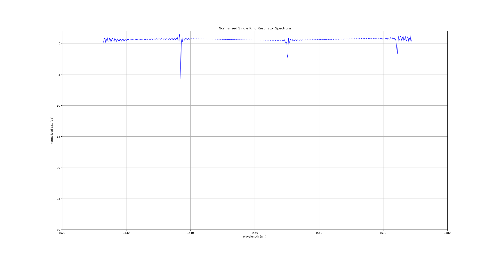

# **완전한 원형 Ring Resonator의 분석 및 한계**

# **1. 개요**
이번에 알아볼 것은 Ring Resonator를 분석합니다. 분석 환경은 Python을 사용하였고 Layout module은 gdsfactory를, FDTD module은 Meep을 사용하였습니다.
Ring Resonator의 스펙은 Bus와 Ring의 gap은 0.2μm이며 Ring의 radius는 5.0μm입니다. length_X, Y는 0이기에 완전한 원형 Ring입니다. λ = 1.55μm입니다.
waveguide의 물질은 Si(실리콘), Cladding 물질은 SiO2이며, 시뮬레이션 도메인은 waveguide 기준 상하 3μm, 좌우 8μm의 여유를 두었습니다.

# **2. 시뮬레이션 세팅 및 정규화**
Source는 Gaussian Source이며 λ = 1.55μm, fwidth = 0.1이고 EigenModeSource를 사용하였습니다. Resolution은 20으로 초기에 설정하였고, 오차를 줄이기 위해 40으로 늘려 더욱 정밀화하였습니다.
정규화를 진행하기 위해 링 구조가 없는 단일 Straight waveguide를 먼저 실험하여 Reference Flux 데이터를 수집하고 저장한 후,

$$S_{21}(\text{dB}) = 10 \times \log_{10}\left(\frac{P_{\text{ring}}}{P_{\text{ref}}}\right)$$

라는 공식을 통해 0dB 기준선 보정을 완료하였습니다.

# **3. 스펙트럼 분석 및 문제점 발견**
먼저 Layout을 보면 다음과 같습니다.


시뮬레이션 분석에 앞서, 먼저 설계한 Ring Resonator의 이론적 FSR을 도출합니다. FSR은 공진 스펙트럼에서 인접한 두 dip 간의 파장 간격을 의미하며, 계산식은 다음과 같습니다.

$$\text{FSR} = \frac{\lambda^2}{n_g \cdot L} = \frac{\lambda^2}{n_g \cdot (2\pi R)}$$

여기서 매개변수들의 조건은 다음과 같습니다.

- **파장 (λ):** 1.55μm (1550nm)
- **반지름 (R):** 5.0μm → 둘레 L = 2πR ≈ 31.42μm
- **실리콘 도파로 그룹 인덱스 (n_g):** ≈ 4.2 (Substrate SiO2, Core Si 기준)

위 수치를 공식에 대입하면 다음과 같이 이론적 FSR을 예측할 수 있습니다.

$$\text{FSR} = \frac{(1.55\mu\text{m})^2}{4.2 \times (2\pi \times 5.0\mu\text{m})} \approx 0.0182\mu\text{m} = \mathbf{18.2\text{nm}}$$

이론적으로 도출된 FSR ≈ 18.2nm에 의하면, 측정 범위인 1430 ~ 1680nm(250nm 대역폭)에서는 약 **13~14개의 주기적인 Resonance Dip**이 관찰되어야 합니다.

이제 Reference 정규화를 적용한 후 추출한 $S_{21}$의 Transmission Spectrum은 다음과 같습니다.


거의 0에 수렴하는 결과가 나왔습니다. 왜일까요? 이를 Transmission Spectrum이 아닌 수치적으로 확인하기 위해

$$\text{Ratio} = \frac{P_{\text{ring}}}{P_{\text{ref}}}$$

이 식을 사용하여 ratio의 범위와 dB의 범위를 수치로 확인해보면 다음과 같습니다.

- **ratio 범위:** 0.9768280116306808 ~ 0.9956251777893413
- **dB 범위:** -0.10181895006862107 ~ -0.019041293025793507

수치로 보니 확실한 문제가 있습니다. 이때 설정한 Transmission Spectrum의 눈금은 (-15, 1)이었습니다. 즉 눈금이 결과에 비해 굉장히 크기 때문에 flat해 보인 겁니다. 이를 (-0.15, 0.02)로 수정 후 측정한 그래프는 다음과 같습니다.


Resolution이 20일 때 Transmission Spectrum입니다. 이를 관찰하였을 때 ring resonance가 보인다고 해석하기는 힘듭니다. 예측한 값과 비교하면 맞지 않는 부분이 있습니다.
앞서 예측한 FSR은 약 18nm였고, 그러면 1430 ~ 1680nm에서는 dip이 약 13~14개 정도 규칙적으로 나와야 하는데 이상합니다.
이를 좀 더 자세히 보기 위해 Resolution을 40으로 올려서 재시뮬레이션하였습니다. 결과는 다음과 같습니다.


Reference Flux를 측정할 때 Resolution을 20으로 잡았기 때문에 40으로 변경 후 Reference Flux 데이터를 재저장하고, 본 시뮬레이션도 Resolution을 40으로 하였음에도 불구하고 거의 비슷한 magnitude가 나왔습니다.
이를 해석해보면, 이 작은 ratio(0.03 ~ 0.06dB)가 진짜 물리적으로 굉장히 약한 결합을 의미하며 설계상 이해가 가능한 결과입니다.
왜냐하면, 설계를 보면 결합 구간, 즉 coupling 구간이 굉장히 좁기 때문입니다. 그렇기 때문에 일단 굉장히 약한 결합이 이루어진다는 확인이 가능하였습니다.
그럼 Resonator를 직역하면 "공진기"인데, **"이러한 스펙의 Ring Resonator는 공진이 일어나지 않네"** 라고 보기에는 어렵습니다. 이유는 다음과 같은 수식으로 설명이 가능합니다.

$$T = \frac{a^2 - 2ra\cos\theta + r^2}{1 - 2ra\cos\theta + (ra)^2}$$

여기서 $r$는 결합 계수이며 $a$는 loss, $\theta$는 위상 변화량을 의미합니다. 즉 $r$이 1에 수렴할수록(커플링이 극도로 약하다면) $\theta$값이 바뀌어도 $T$가 1 근처에서 매우 미세하게 움직이게 됩니다.
$\theta$는 오직 $L$, 즉 링의 둘레와 group index에만 의존하기 때문에 $r$과 $a$는 dip의 깊이만 결정할 뿐, 공진이 일어나느냐 일어나지 않느냐를 결정하지는 않습니다.
즉 이는 "완전한 원형 Ring Resonator는 공진할 수가 없다"가 아니라, gap = 0.2μm, radius = 5.0μm의 조건에서는 결합의 길이가 짧아서 through에서 관측되는 extinction ratio가 매우 얕다는 것이 맞는 결론입니다. bus에서 봤을 때 "티가 안 난다"는 상태인 것입니다.
이때까지는 계속 bus를 통한 간접적인 관측으로만 보았는데, 공진이 실제로 존재하는지 직접 확인하기 위해 Harminv를 이용해 링 내부를 직접 관찰하고 수치로 확인하였습니다.

**--- Harminv 결과 ---**
**freq=0.6408500985034019, Q=3112.8128854260626, wavelength=1560.43nm**

Q = 3112.8이라는 값이 나왔습니다. 이는 "through에서 보는 extinction ratio가 굉장히 얕다"는 결과와 정확히 이어집니다.
즉 결합이 약함 → Ring으로 전달되는 에너지가 적음 → 반대로 Ring으로 전달된 에너지가 bus로 전달되기 힘듦 → 링 안에 에너지가 오랫동안 머무름 → 에너지가 장기적으로 잔류 → Q factor가 높아짐.
공진 파장이 1560.43nm인데 원래 목표는 1550nm로, 오차가 약 10nm(0.6%) 수준입니다. 이는 시뮬레이션 환경이 3D가 아닌 2D이므로 합리적인 범위입니다.

# **4. Coupling 효율을 높이기 위한 선택: Racetrack Ring Resonator**
이전 완전한 원형 Ring Resonator의 문제점은 coupling 구간이 짧아 Ring과 bus 간의 에너지 전달이 약하고 Q factor만 높아지는 결과를 보였다는 것입니다. 이를 개선하기 위해 Ring의 모양을 조절해 coupling 구간을 늘려서 만든 것이 Racetrack Ring Resonator입니다.
Layout을 보면 다음과 같습니다.



Layout에서 Ring의 모양을 보면 Racetrack처럼 생긴 것을 알 수 있습니다. 이 Ring의 스펙은 radius = 5.0, length_X = 3.0입니다. 즉 Ring의 X축 길이를 늘려 coupling 구간을 3μm로 늘린 것입니다.
이제 이론적으로 FSR을 구해보겠습니다. 마찬가지로 이번 실험도 파장(λ): 1.55μm(1550nm)입니다. 구하는 과정은 다음과 같습니다.

$$\text{L} = 2 \cdot \text{length}_X + 2\pi R = 2(3) + 2\pi(5) \approx 37.42\mu\text{m}$$

$$\text{FSR} = \frac{(1.55\mu\text{m})^2}{4.2 \times (37.42\mu\text{m})} \approx 15.3\text{nm}$$

# **5. Racetrack Ring Resonator 분석**
이전 파트를 통해 Racetrack Ring Resonator를 알게 되었고 FSR 값도 구했습니다. 이번 파트에서는 시뮬레이션을 통해 Transmission Spectrum을 추출하여 분석해보겠습니다.
실험 환경은 Ring의 radius = 5.0μm, length_x = 3.0μm이며, waveguide의 물질은 Si, Cladding의 물질은 SiO2입니다. 시뮬레이션 도메인은 waveguide 구조 기준으로 상하 3μm, 좌 8μm, 우 10μm입니다. λ = 1.55μm입니다.



**--- Harminv 결과 ---**
```
freq=0.6360424346854524, Q=6507.531341176368,  wavelength=1572.22nm
freq=0.6360968718518586, Q=2949.833740557841,  wavelength=1572.09nm
freq=0.6430307620127971, Q=14885.29645475724,  wavelength=1555.14nm
freq=0.6430436658356912, Q=5652.192236345133,  wavelength=1555.10nm
freq=0.6499840271911567, Q=10004.690094244379, wavelength=1538.50nm
freq=0.6500139889993141, Q=12078.121012229258, wavelength=1538.43nm
```

스펙트럼을 확인하니 좋은 결과를 얻을 수 있습니다. 1538nm 근처에 약 -5.7dB, 1554nm 근처에 약 -2.3dB, 1572nm 근처에 약 -1.7dB라는 dip을 얻었으며, 이는 원형 Ring Resonator보다 훨씬 뛰어난 결과입니다.
이는 coupling length를 늘리면 coupling이 강해진다는 결론에 도달하는 직접적인 근거가 되었습니다.
dip의 간격을 보면 1538 → 1554(16nm), 1554 → 1572(18nm)이며, 이는 앞서 예측한 FSR 값 15.3nm과 비교하면 오차 범위 안에서 잘 맞는 결과입니다.
Harminv 결과를 보면 파장이 1538, 1555, 1572nm로 나왔습니다. 이는 S21의 dip 간격과 거의 정확하게 일치하며, 현재 이 Racetrack에서는 공진 모드가 세 가지 있다는 것을 확인할 수 있습니다.
한 가지 짚을 점이 있다면, dip 간격마다 모드가 쌍으로 존재하는데 이는 물리적으로 2개의 모드가 존재하는 것이 아니라 Harminv 알고리즘의 수치적 특성입니다. 따라서 각 파장당 하나의 물리적 모드로 해석하면 됩니다.
ripple에 대해 얘기하자면, 이는 넓은 파장 범위(1520nm ~ 1580nm)를 좁은 대역폭을 가진 source로 커버하다 보니 파장의 끝쪽으로 갈수록 source power가 약해져서 생기는 노이즈입니다.
Harminv에서 각 파장의 dip 간격을 보면 1538.5 ~ 1555.1 = 16.6nm, 1555.1 ~ 1572.2 = 17.1nm이며, 예측 FSR 값 15.3nm와 오차가 8~12%이므로 잘 맞는 결과입니다.
하지만 여전히 Q값이 2900~14900으로 상당히 높습니다. 이는 해당 스펙의 Racetrack이 강한 결합 상태는 아니라는 것을 의미합니다. 이를 해결하려면 coupling 구간을 더 늘리거나 gap을 줄여서 강한 결합 상태, 즉 dip이 -20dB ~ -30dB에 더 가까워지도록 해야 합니다.

# **6. 결론**
- **원형 Ring Resonator**: through port만으로는 공진 여부를 판단하기 어려웠으나, coupled mode theory 및 Harminv를 통한 Ring 내부 직접 관측으로 공진이 실제로 존재함을 확인하였습니다(Q=3112.8). 다만 짧은 coupling 구간으로 결합이 매우 약해(undercoupled) extinction ratio가 낮았습니다.

- **Racetrack Ring Resonator**: coupling length를 3μm로 늘린 결과, extinction ratio가 최대 -5.7dB까지 개선되었고, 예측한 FSR 값 15.3nm과 실측정 결과 16.6~17.1nm가 오차 8~12% 범위에서 일치함을 확인하였습니다. 이를 통해 coupling length가 결합 세기를 직접적으로 결정하는 파라미터임을 정량적으로 검증하였습니다.

## 한계점 및 아쉬운 점
- 2D effective index 근사를 사용하여, 정확한 $n_{eff}$/$n_g$ 대신 근사치를 사용함에 따른 오차가 있었습니다. 또한 여전히 undercoupled 상태로 critical coupling에는 도달하지 못했습니다.
- 연산 환경이 MPI 기반 병렬 처리 없이 단일 코어로 진행되어, 특히 Racetrack Ring Resonator처럼 높은 Q factor를 가진 구조는 decay_by 수렴 조건을 만족하기까지 많은 시간이 소모되었습니다(Racetrack 시뮬레이션 시간 약 4시간 30분). 중간에 MPI 병렬화를 시도하였으나 기존 의존성과 바이너리 호환성 문제로 실패하였고, 시간 제약상 단일 코어 환경으로 진행할 수밖에 없었습니다.
- Meep의 2D 근사 FDTD와 (추후 도입한) Tidy3D의 3D FDTD 결과 사이에 스펙트럼 차이가 크게 나타났는데, 이는 2D effective index 근사의 한계로 판단하여 이후 프로젝트에서 3D FDTD 엔진(Tidy3D)로 전면 전환하는 계기가 되었습니다.

## 향후 방향
- gap을 줄이거나 coupling length를 더 늘려 critical coupling(-20dB ~ -30dB)에 도달시키고, MPI 병렬화를 재구성하여 검증 정밀도(resolution)를 높일 계획입니다.
- 2D 근사의 한계를 넘어서기 위해 3D FDTD(Tidy3D) 기반으로 동일 구조를 재검증하는 후속 프로젝트로 이어집니다. → [`Two-Channel WDM Add-Drop Filter via Circular MRR (Tidy3D)`](./README.md)
