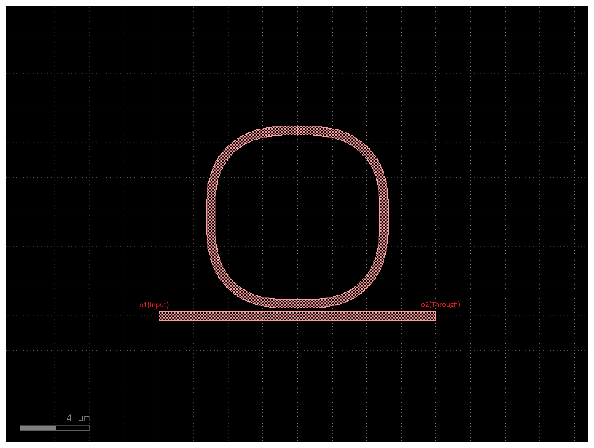
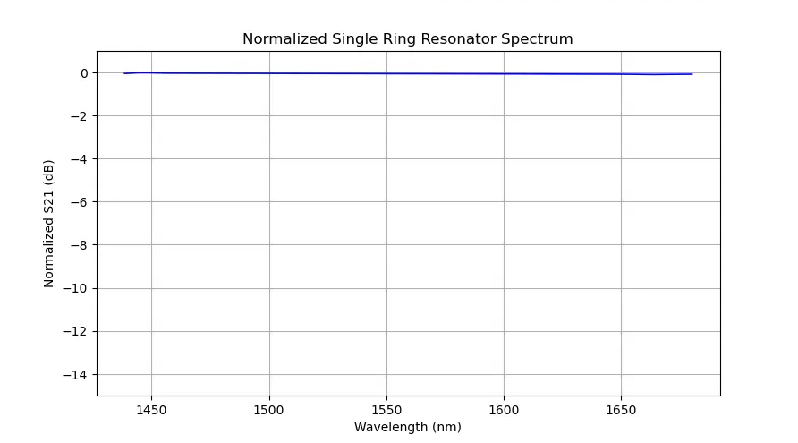
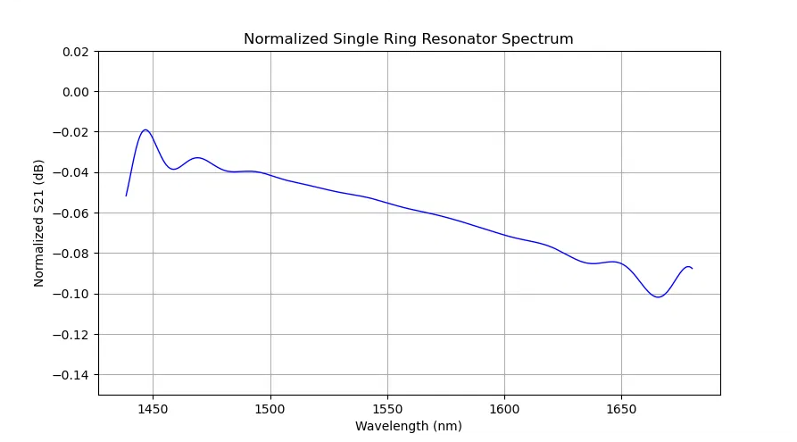
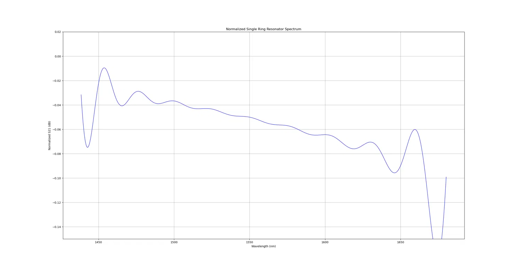

# **완전한 원형 Ring Resonator의 분석 및 한계**
# **1.개요**
이번에 알아볼 것은 Ring Resonator를 분석합니다. 분석 환경은 Python을 사용하였고 Layout module은 gdsfactory를 사용 FDTD module은 Meep를 사용하였습니다.  
Ring Resonator의 스펙은 Bus와 Ring의 gap은 0.2μm 이며 Ring의 Radius는 5.0μm 입니다. length_X, Y는 0이기에 완전한 원형 Ring입니다. λ = 1.55μm 이며 주파수로는 1/1.55입니다.  
waveguide의 물질은 Si 실리콘이며 Cladding 영역은 SiO2 즉 silicon-dioxide 이며 이는 표준 PDK를 사용합니다.  
  
# **2.시뮬레이션 세팅 및 정규화**
시뮬레이션하기 위해 Source는 Gaussian Source 이며 λ = 1.55μm, Fwidth = 0.1이고 EigenModeSource를 사용하였습니다. Resolution는 20으로 초기에 설정하였고 오차를 줄이기 위해 40으로 늘려 더욱 정밀화를 하였습니다.  
정규화를 진행하기 위해 링 구조가 없는 단일 Straight waveguide를 먼저 실험 하여 Reference Flux 데이터를 수집하고 저장 후  
$$S_{21}(\text{dB}) = 10 \times \log_{10}\left(\frac{P_{\text{ring}}}{P_{\text{ref}}}\right)$$ 라는 공식을 통해 $0\text{dB}$ 기준선 보정을 완료 하였습니다.  

# **3.스펙트럼 분석 및 문제점 발견**
먼저 Layout을 보면 다음과 같습니다.  
  
  

시뮬레이션 분석에 앞서, 먼저 설계한 Ring Resonator의 이론적 FSR를 먼저 도출합니다. FSR은 공진 스펙트럼에서 인접한 두 Dip 간의 파장 간격을 의미하며, 계산식은 다음과 같습니다.  
  
$$\text{FSR} = \frac{\lambda^2}{n_g \cdot L} = \frac{\lambda^2}{n_g \cdot (2\pi R)}$$  
  
여기서 매개변수들의 조건은 다음과 같습니다.  
  
**파장 ($\lambda$):** $1.55\mu\text{m}$ ($1550\,\text{nm}$)  
**반지름 ($R$):** $5.0\mu\text{m}$ $\rightarrow$ 둘레 $L = 2\pi R \approx 31.42\mu\text{m}$  
**실리콘 도파로 그룹 인덱스 ($n_g$):** $\approx 4.2$ (Substrate $\text{SiO}_2$, Core $\text{Si}$ 기준)  
위 수치를 공식에 대입하면 다음과 같이 이론적 FSR을 예측할 수 있습니다.  
  
$$\text{FSR} = \frac{(1.55\\mu\text{m})^2}{4.2 \times (2\pi \times 5.0\mu\text{m})} \approx 0.0182\mu\text{m} = \mathbf{18.2\text{nm}}$$  
  
이론적으로 도출된 $\text{FSR} \approx 18.2\text{nm}$ 에 의하면, 측정 범위인 $1430 \sim 1680\\text{nm}$ ($250\text{nm}$ 대역폭) 에서는 약 **13~14개의 주기적인 Resonance Dip**이 관찰되어야 합니다.  
  
이제 Reference 정규화를 적용한 후 추출한 $S_{21}$ 의 Transmission Spectrum 는 다음과 같습니다.  
  
  
  
거의 0에 수렴하는 결과가 나왔습니다. 왜 일까요? 이를 Transmission Spectrum가 아닌 수치적으로 확인하기 위해 
  
$$\text{Ratio} = \frac{P_{\text{ring}}}{P_{\text{ref}}}$$ 
  
이 식을 사용하여 ratio의 범위와 dB의 범위를 한번 수치로 확인해보면 다음과 같습니다.  
  
**ratio 범위: 0.9768280116306808 ~ 0.9956251777893413**  
**dB 범위: -0.10181895006862107 ~ -0.019041293025793507**  
  
수치로 보니 확실한 문제가 있습니다. 이때 설정한 Transmission Spectrum의 눈금은 (-15, 1)이였습니다 즉 눈금이 결과에 비해 굉장히 크기 때문에 flat해 보인 겁니다. 이를 (-0.15, 0.02)로 수정 후 측정한 그래프는 다음과 같습니다.  
  
  
Resolution이 20일때 Transmission Spectrum 입니다. 이를 관찰 하였을 때 ring resonance가 보인다고 해석하기는 힘듭니다 예측한 값과 비교하면 안맞는 부분이 있습니다.  
앞서 예측한 FSR는 약 18nm 이였고 그러면 1430 \~ 1680nm 에서는 dip이 약 13 \~ 14개 정도 규칙적으로 나와야 하는데 이상합니다.  
이를 좀 더 자세한 결과로 보기 위해 Resolution를 40으로 올려서 시뮬레이션을 해보았습니다. 결과는 다음과 같습니다.  
  
  
  
Reference Flux를 측정할 때 Resolution을 20으로 잡았기 때문에 40으로 변경 후 Reference Flux 데이터를 재 저장하고 본 시뮬레이션도 Resolution을 40으로 하였음에도 불구하고 거의 비슷한 magnitude가 나왔습니다.  
이를 해석해보자면 이 작은 ratio가(0.03 ~ 0.06dB)가 진짜 물리적으로 굉장히 약한 결합을 의미하고 설계 상 이해가 가능한 결과입니다.  
왜냐? 설계를 보면 결합 구간 즉 coupling 구간이 굉장히 좁습니다. 그렇기 때문에 일단 굉장히 약한 결합이 이루어 진다는 확인이 가능하였습니다.  
자 그럼 Resonator를 직역하면 "공진기" 인데 **"이러한 스펙의 Ring Resonator는 공진이 일어나지 않네~"** 라고 보기에는 어렵습니다. 이유는 다음과 같은 수식으로 설명이 가능합니다.
  
$$T = \frac{a^2 - 2ra\cos\theta + r^2}{1 - 2ra\cos\theta + (ra)^2}$$  
  
여기서 $r$는 결합 계수이며 $a$는 Loss이고 $\theta$는 위상 변화량을 의미합니다. 즉 $r$이 $1$에 수렴할 수록(커플링이 극도로 약하다면) $\theta$값이 바뀌어도 $T$가 $1$ 근처에서 매우 미세하게 움직이게 됩니다.
그리고 $\theta$는 오직 $L$ 즉 링의 둘레와 group index에만 의존하기 때문에 $r$과 $a$는 dip의 깊이만 결정하고 공진이 일어나느냐 일어나지 않느냐 를 결정하지는 않습니다.
즉 이는 "완전한 원형 Ring Resonator는 공진할 수 가 없다."가 아니라 gap = 0.2μm, radius = 5.0μm의 조건에는 결합의 길이가 짧아서 그 결과 through에서 관측되는 extinction ratio가 매우 얕다가 맞는 결론입니다. bus에서 봤을 때 "티가 안 난다"라는 상태인 거죠
이때까지는 계속 bus를 통한 간접적인 관측으로만 보았는데 공진이 실제로 존재하는지 직접 보기 위해 링 내부를 관찰을 해보고 수치로 확인하였습니다.  
  
--- Harminv 결과 ---  
**freq=0.6408500985034019, Q=3112.8128854260626, wavelength=1560.43nm**  
보면 Q = 3112.8이라는 값이 나왔습니다. 이는 "through에서 보는 extinction ratio 가 굉장히 얕다"라는 결과와 정확히 이어집니다.  
즉 결합이 약함 -> Ring으로 전달되는 에너지가 적음 -> 반대로 Ring으로 전달된 에너지가 bus로 전달이 힘들다 -> 링 안에 에너지가 오랫동안 머무름 -> 에너지가 장기적으로 잔류 ->Q factor가 높아짐  
공진 파장이 1560.43nm 인데 원래 목표는 1550nm로 오차가 약 10nm(0.6%)정도 수준인데 이거는 시뮬레이션 환경이 3d가 아닌 2d이므로 합리적인 범위입니다.

# **4.Coupling 효율을 높이기 위한 선택:RaceTrack Ring Resonator**

