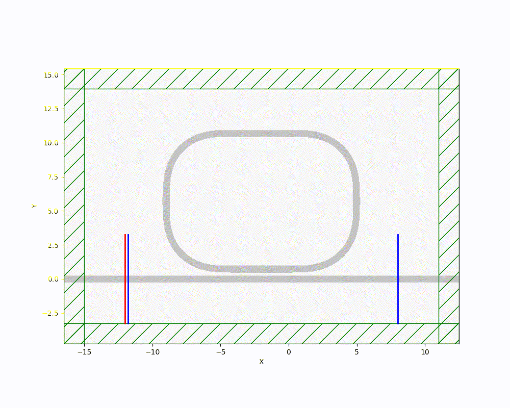

# **Optical-Ring-Resonators-Simulation**
**Meep** 와 **Gdsfactory** 파이썬 모듈을 이용하여 링 공진기 구현 및 시뮬레이션 

# **Ring Resonators Analysis**
이번 프로젝트는 링 공진기를 구현 및 시연 그리고 입력에 따른 변화를 분석하는 프로젝트 입니다.

# **Key Features**
**Silicon Photonics Layout Design**:Gdsfactory를 활용하여 0.5μm 폭의 Single Ring Resonators 설계 및 표준 PDK 기반 레이아웃 생성

**FDTD Simulation Setup**:Meep 엔진을 연동하여 FDTD 시뮬레이션을 진행 또한 표준 PDK를 이용하여 시뮬레이션 신뢰도 향상

**Pulse and CW(Continuous Wave) Analysis**: Wave 가 Pulse일때 Ring Resonators의 응답과 CW일때 응답을 관찰하여 비교

# **Simulation Result**

